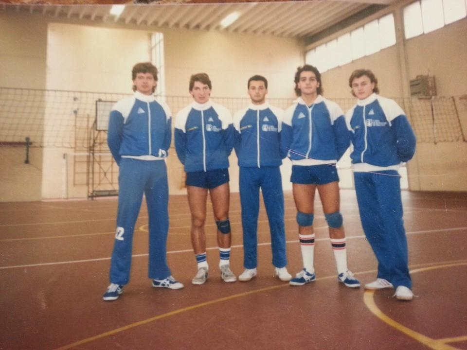
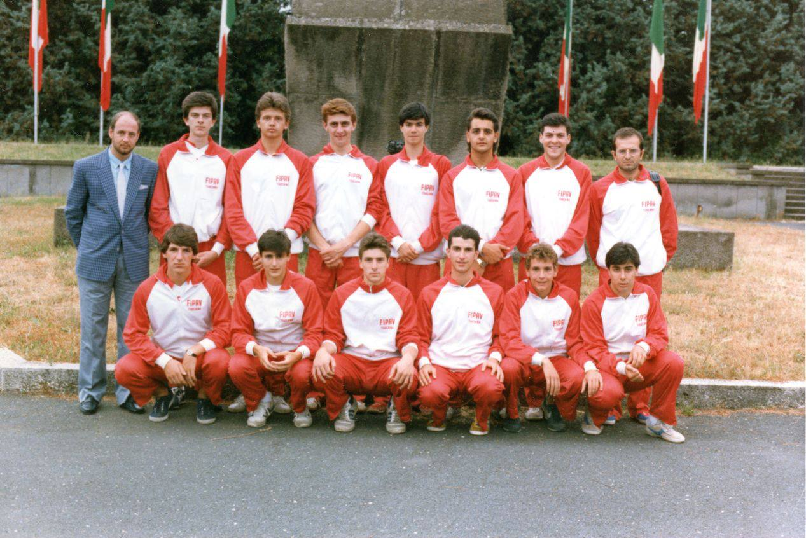
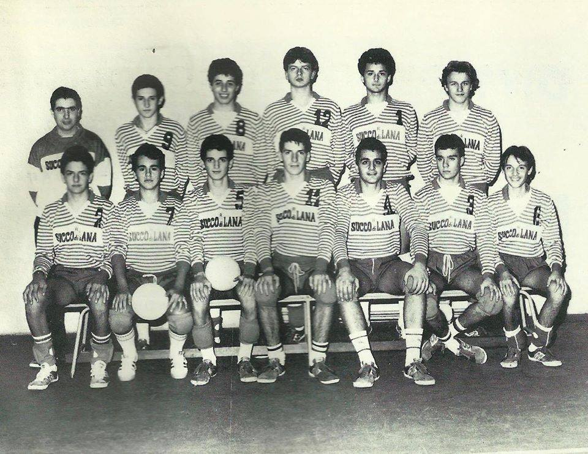
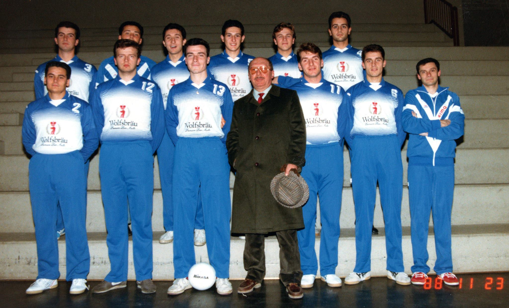

# Pallavolo Scandicci

Date: ?

Da sinistra: Raffaele Palumbo, Luca Mugnaini, Alessandro Pratesi, Roberto Bruno, Fabrizio Setti, Stefano Gemmi, Massimiliano Bartolacci, Riccardo Corsi, Massimo Marconi, Umberto Liguori, Paolo Cipriani, Leonardo Terzani

---

Date: ?

Scuola Media "Gianni Rodari" - Scandicci

Da sinistra in piedi: Luca Mugnaini, Massimiliano Bartolacci, Massimiliano Vacante, Raffaele Palumbo, Paolo Cipriani

---

## Squadra della regione Toscana

Date: ?

Da sinistra in piedi: (?), Alessandro Bachi, Luca Mugnaini, Enrico Gugliotti, Riccardo Riccioni, Raffaele Palumbo, Roberto Picchi, Stefano Marchi

Da sinistra accosciati: Massimiliano Bartolacci, (?), Materassi(?), Massimo Marconi, Simone Amidei, Emanuele Centi

---

## 1986 - Scandicci Succo di Lana

Date: 1986

Prima classificata alle Provinciali di Firenze (Finale contro Gandi Firenze) (?)

Da sinistra in piedi: Riccardo Bartalesi, Leonardo Terzani, Davide Checcucci, Luca Mugnaini, Massimiliano Vacante, Paolo Cipriani

Da sinistra seduti: Alessandro Pratesi, Umberto Liguori, Andrea Prosperi, Massimiliano Bartolacci, Raffaele Palumbo, Enrico Maria Cartei, Roberto Bruno

---

## Scandicci Wolfsbräu - Serie C, Stagione 1988-89

Date: 23 Novembre 1988

Palazzetto dello Sport di Scandicci

In piedi dietro, da sinistra: Massimo Marconi, Massimiliano Vacante, Peruzzi Stefano, Terzani Leonardo, Paolo Cipriani, Palumbo Raffaele

In piedi avanti, da sinistra: Alessandro Gori, Luca Mugnaini, Fabio Paoli, Carlo Emilio Bartolacci Iacarelli, Massimiliano Bartolacci, Francesco Fani, Fabrizio Taverna

